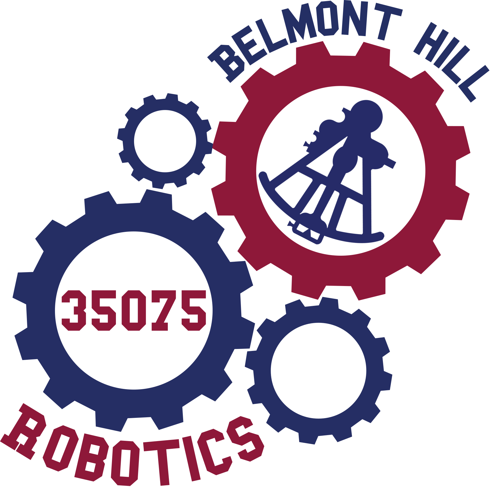

<div id="readme-top"></div>

<!-- PROJECT HEADER -->



# 👋 Welcome to the Bolles Makerspace

> Home of the code, documentation, and projects for Belmont Hill Robotics

<!-- CALL TO ACTIONS -->

[](https://www.belmonthill.org/academics/makerspace/robotics) [](https://docs.google.com/spreadsheets/d/1Smz0CalpF-jE7a2SaGa_jDIG1iLWu79YZ74349uV4Gw/edit?gid=137642311#gid=137642311) [](https://docs.google.com/document/d/1SjdNTTJCPgrgd9IDQ0ClZmTv1YIK-AfD-5bnmVDkVfw/edit?tab=t.0#heading=h.9a4g126o8pnp) [](https://www.instagram.com/belmont_hill_robotics/?hl=en)

<!-- TABLE OF CONTENTS -->
<details>
  <summary>Table of Contents</summary>
  <ol>
    <li><a href="#teams">Teams</a></li>
    <li><a href="#getting-started">Getting Started</a></li>
    <li><a href="#usage">Usage</a></li>
    <li><a href="#troubleshooting">Troubleshooting</a></li>
    <li><a href="#conventions">Conventions</a></li>
    <li><a href="#contact">Contact</a></li>
    <li><a href="#resources">Resources</a></li>
  </ol>
</details>
  <!-- ABOUT THE PROJECT -->

## Teams

> School Identification Number: 35075

### Repositories 
[](https://github.com/Belmont-Hill-Makerspace/35075A) [](https://github.com/Belmont-Hill-Makerspace/35075C_2024-2025) [](https://github.com/Belmont-Hill-Makerspace/35075X_Main_24-25)

### Results
[](https://www.robotevents.com/teams/V5RC/35075A) [](https://www.robotevents.com/teams/V5RC/35075B) [](https://www.robotevents.com/teams/V5RC/35075C) [](https://www.robotevents.com/teams/V5RC/35075X)

<p align="right">(<a href="#readme-top">back to top</a>)</p>

<!-- GETTING STARTED -->

## Getting Started

> Quick-start guide for robotics development: essential tools, resources, and onboarding instructions for new and returning team members.


### Readings
- [Student Centered Policy](https://v5rc-kb.recf.org/hc/en-us/articles/9654578622487-Student-Centered-Policy)
- [Driving Course Training](https://v5rc-kb.recf.org/hc/en-us/articles/9652732380055-VEX-V5-Robotics-Competition-Drive-Team-Training-Course-2024-25-High-Stakes)
- [Notebook Rubric](../resources/notebook-rubric.pdf)
- [Engineering Design Process](https://v5rc-kb.recf.org/hc/en-us/articles/9628278280215-Engineering-Design-Process)
- [PID Controller Introduction](https://drive.google.com/file/d/166zqVQZYmXL9I0Y7ppLrOE1ZkAhLqQ1O/view)


### Installations

> The development of these projects requires the use of some key tools that help reduce the pain points of robotics.

- [git](https://git-scm.com/): a version control system for tracking code changes and team collaboration
- [GitHub Desktop](https://desktop.github.com/download/): interact with Team 35075 remote code repositories
- [C++ Compiler](https://releases.llvm.org/download.html): a toolchain for compiling and running C++ programs, typically pre-installed on most systems
- [Visual Studio Code](https://code.visualstudio.com/): integrated development environment (IDE) to make coding all you have to think about
- [VEX Extension](https://marketplace.visualstudio.com/items?itemName=VEXRobotics.vexcode): an extension for managing and developing VEX robotics projects efficiently
- [PROS Extension](https://marketplace.visualstudio.com/items?itemName=sigbots.pros): extension for Visual Studio Code to streamline VEX using the PROS framework

<p align="right">(<a href="#readme-top">back to top</a>)</p>

<!-- USAGE EXAMPLES -->

## Usage

> Step-by-step guide to update code, prepare the robot, and deploy logic for smooth operations.

1. Code update: pull any potential changes from the repository to your local machine.
2. Robot setup: check and fill air canisters, ensure battery is charged, and power on the robot.
3. Controller connect: link controller to VEX Robot Brain with and ensure the controller is on.
4. Logic upload: push updated code to VEX brain using a Micro-USB port at the bottom of the controller and running the `Build and Upload` command from the PROS keybind using the `OPTION-COMMAND-M` on MacOS or `CONTROL-ALT-M` on Windows.

<p align="right">(<a href="#readme-top">back to top</a>)</p>

<!-- STRUCTURE -->

## Troubleshooting

> Guide to identify and resolve common issues encountered during development and deployment.

* **Missing Files**: Verify that the repository was cloned using GitHub Desktop. If files are missing, re-clone the repository to ensure all dependencies are included.
* **Unsupported Versions**: Check that the latest versions of PROS, LemLib, and C++ are installed. Update any outdated tools to maintain compatibility with the codebase.
* **Merge Conflicts**: Before starting work, confirm that no other team member is editing the same file. If conflicts occur, use GitHub Desktop to compare changes and resolve them by selecting the appropriate code.
* **Build Errors**: If the build and upload process fails when connected to the controller, try the following steps:
  * Ensure the Micro-USB cable is securely connected to both the controller and your computer.
  * Restart the controller and VEX Robot Brain, then attempt the upload again.
  * Verify that the correct COM port is selected in the PROS settings.
  * If the issue persists, disconnect and reconnect the cable, then retry the upload process.
  * Repeat the upload process a few times, as intermittent connectivity issues may resolve after multiple attempts.
<p align="right">(<a href="#readme-top">back to top</a>)</p>

<!-- CONVENTIONS -->

## Conventions

> Ensure consistent and clear communication within the team.

- [Version Control](https://git-scm.com/book/ms/v2/Getting-Started-About-Version-Control): Tracking releases through consistent commit messages and branching strategies ensures a clear development history, simplifies collaboration, and enables efficient debugging. This is key to maintaining a stable working version of the robot's control system. *Our team uses the [**git**](https://git-scm.com/) version control system with **GitHub** as the provider.* Example usage of the git CLI tool provided below in order of usage frequency:

```bash
git add <FILE_NAME>                    # update to staged status
git commit -m "description of change"  # update to committed status
git status                             # show the state of local project files and the branch you are working on 
git pull                               # update local code with remote branch
git push                               # update remote branch with local code
```
> **NOTE**: There are four 'states' that the changes must go through locally to be pushed to the remote repo, which are unstaged, staged, committed, and then pushed. 

- [Branches](https://www.geeksforgeeks.org/how-to-naming-conventions-for-git-branches/): Using branch prefixes to highlight main objective followed by a brief description of the task or feature. If referencing a specific issue number, that would be appended between the prefix and description. Branch creation can be done by typing `git checkout -b feature/no-ref/example-branch`. The `no-ref` indicates that the branch is not linked to a specific [issue](https://docs.github.com/en/issues/tracking-your-work-with-issues/about-issues) and may be omitted if unnecessary Examples included below:

```
feature/add-PID-controller
fix/tuning-parameters
refactor/autonomous-code
experiment/odometry

# Example with issue reference
fix/2/adjust-for-drag
```

- [Commits](https://www.conventionalcommits.org/en/v1.0.0/): Creating an explicit commit history helps other team members understand the changes made and the purpose behind them. Use the following to create a commit: `git commit -m '<type>(<scope>): <description>'`. Put simply, `<type>` is what you did in one word, `<scope>` is where you made the changes, and `<description>` is why you did it. Examples included below with the use and omission of the optional `<scope>` parameter:

```
feat(auton): add initial body of PID controller
chore: update LemLib dependency
docs(README): add reference to new LemLib version
```

<p align="right">(<a href="#readme-top">back to top</a>)</p>

<!-- CONTACT -->

## Contact

- *Mr. Ziff* 
ziff@belmonthill.org
- *Dr. Courtney* 
courtneym@belmonthill.org
- *Mr. Montanaro* 
montanaromi@belmonthill.org
- *Makerspace* 
makerspace@belmonthill.org


<!-- ACKNOWLEDGMENTS -->

## Resources

> List of tools, guides, and references to support team development and competition preparation.

- [Team Onboarding](https://docs.google.com/document/d/1whrOCQnMydUBSRAIzF3DLwpIgiGeJW2IJBwofPdJwrg/edit?tab=t.0)
- [Team Structure](https://docs.google.com/document/d/1HGfOmp4Jzs1z97b0kVVJCrXrusYIctIA1AUXEvfGLv8/edit?tab=t.0#heading=h.i6vsyx74zumg)
- [Setup Guide](https://www.youtube.com/watch?v=4DwnphVdJZY)
- [Path Planner](https://path.jerryio.com/)
- [Notebook Example](https://www.youtube.com/watch?v=KNKPfB-uvCQ)
- [Vex Robotics Competition](https://www.vexrobotics.com/competition?srsltid=AfmBOorQ0W4qS9sFXGZuwn9fIrg5r_hfeYErFh6L5dMTq7sek5CZSAd4)
- [PROS by Purdue](https://pros.cs.purdue.edu/)
- [LemLib Documentation](https://lemlib.readthedocs.io/en/stable/)
- [Interview Examples](https://kb.vex.com/hc/en-us/articles/8780653442964-Get-Started-Engineering)
- [Git Walkthrough](https://docs.google.com/document/d/19ks0UKsG-ARE1dvPBA0KZH7x2ydUUlYKGbLfuoC4uxM/edit?tab=t.0)
- [Scheduling](https://calendly.com/bhsmakerspace/)

<p align="right">(<a href="#readme-top">back to top</a>)</p>
